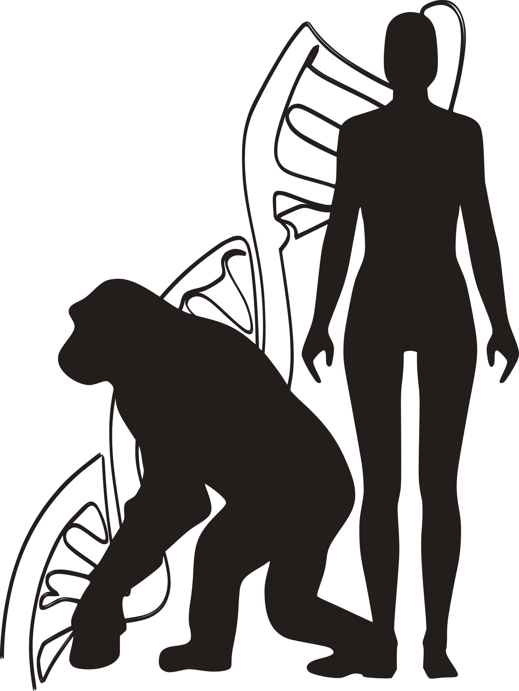

- **Tandem Repeat Evolution**  

  
  

    Tandem repeats (TRs) are repetitive DNA sequences crucial in genome evolution and function.
    Technological limitations held back our grasp of these elements until recently. With long-read, high-fidelity whole-genome sequencing and advanced analytical tools, we are poised to uncover the extensive TR variation across eukaryotic genomes.
  

  

    During my postdoc research, I am focused on understanding the evolution of TRs in primate genomes, particularly those of humans, chimpanzees, and bonobos.
    We are leveraging long-read data within and between species to test evolutionary hypotheses about how TR variation drives ape adaptation.
  

- **Coral Phylogenetics**  

  
  

    Scleractinian corals, known as "hard corals", are the main builders of coral reefs, and are extremely susceptible to environmental disturbances. To design effective conservation plans, it is essential to identify the taxonomic units that make up the reef
    ecosystem and fully understand their population dynamics and genetic diversity.
  

  

  During my PhD, I used next-generation sequencing data to assess the species boundaries and population genetic structure of Atlantic reef-building corals. 
  My emphasis was on the understudied Brazilian species, which form the only true coral reefs of the South Atlantic. 
  

